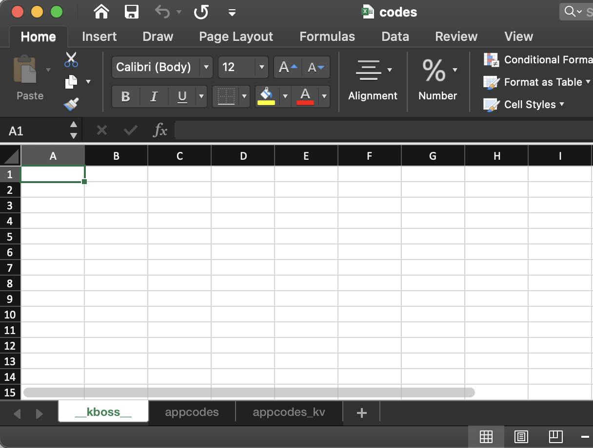
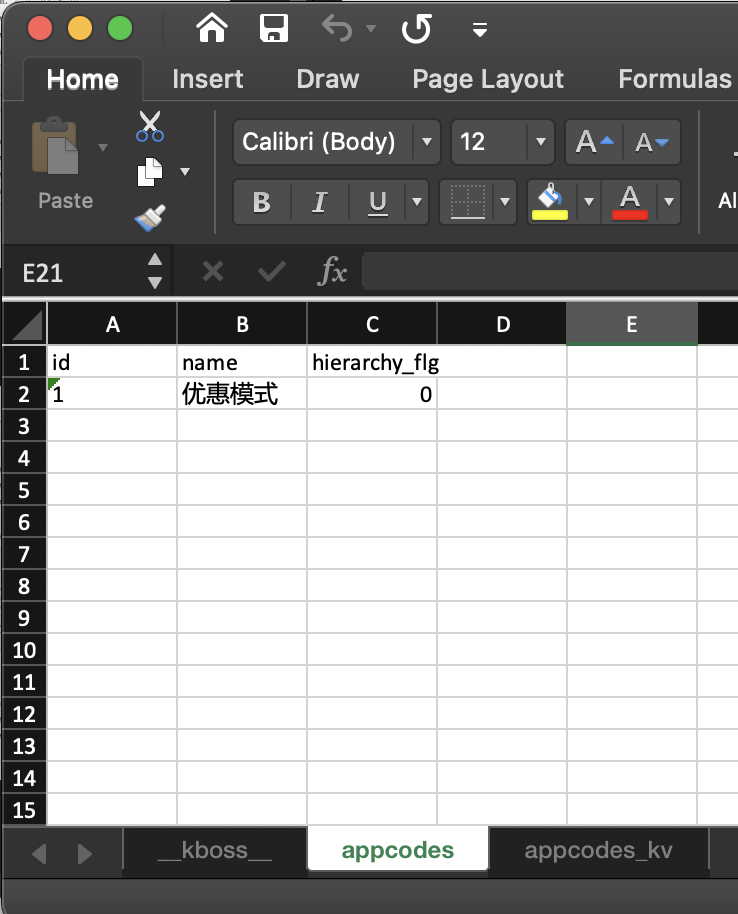
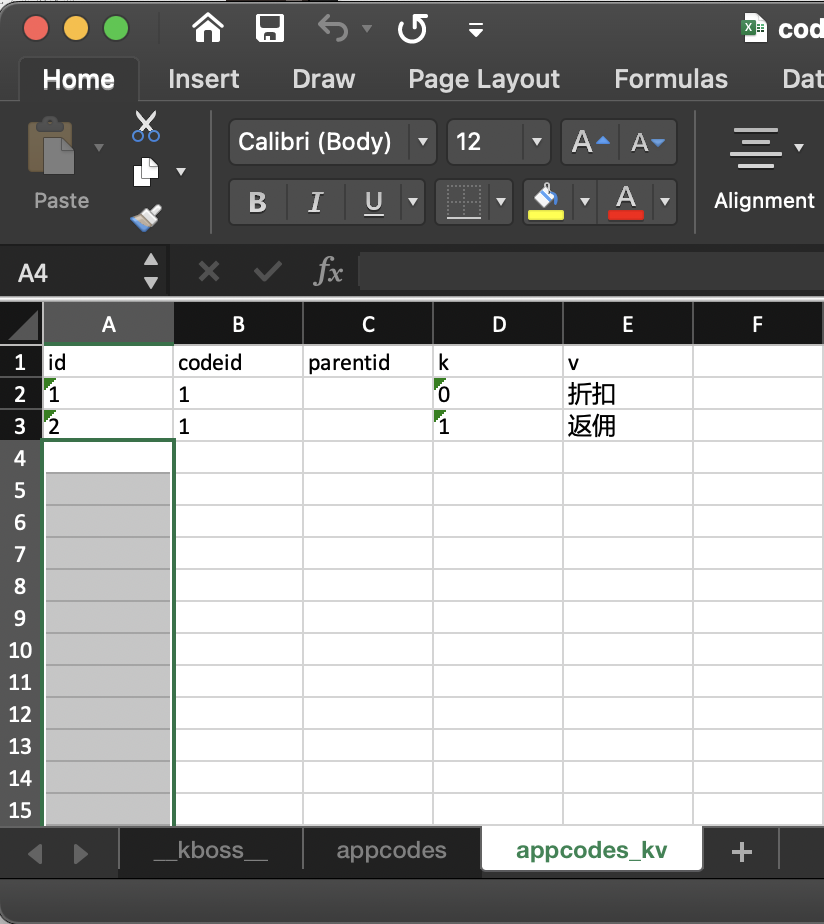

# dataloader 
a tool to load data into database from excel file

## Dependents
* [Gadget](https://github.com/yumoqing/gadget)

You should have a gadget run environment installed before, the dataloader
uses gadget conf/config.json file to read the database configuation.

## Usage
change the current folder to gadget running folder(it contains a "conf" folder which config.json file in it), then
```
datalaoder excel_data_file
```

## Excel file format

### Specifies the target database 
use a datasheet to set the sheet name preffix and subffix with '__', examples:
"__testdb__" stand for "testdb", "__mydatabase__" stand for "mydatabase",

### Specifies the target table
the table name will use to insert data can be specifies by set the sheet name as the table name

### Specifies the field name
dataloader can inserts data to a table not necesary provide all the fields data, the table's nullable fields can be ignore.

first row in the sheet is use to specify the fields with data, each cell for one field, value of the cell should be fill in the table's field name.

### Specifies the data
Data start from second row in the sheet, each row for one records

## Examples
there is a kboss database in databases, and the kboss database have two tabel named by 'appcodes' and 'appcodes_kv'

* Specify database


* Specify table appcodes


* Specify table appcodes_kv


